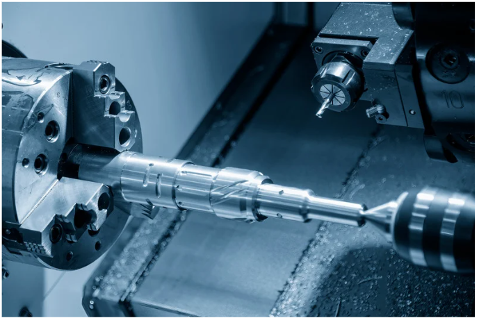
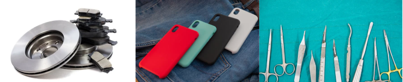

# 什麼是CNC

# 前言
身在台灣的各位不能不知道台灣的二級產業「製造業」，台灣製造業在全球佔有重要地位，以精密加工與創新技術著稱。電腦數值控制（CNC）技術的引入，革新了傳統加工方式，大幅提升加工精度與效率，成為製造業現代化的關鍵推手。隨著工業4.0的興起，CNC更進一步整合智慧製造，展現出其在高端生產中的不可或缺性。



```
傳統加工：

傳統加工包括車、鉗、鉋、銑、磨等工藝，透過機械設備進行切削與成型。車削加工旋轉零件，銑削切削平面與形狀，鉋削加工直線表面，磨削提升精度與光潔度，鉗工作為裝配輔助。這些技術在小規模生產中仍具重要性。 
```

# CNC的產品

**CNC產品舉例：**  
1. 機械零件：汽車引擎零件、齒輪、軸承。  
2. 消費性電子：手機外殼、筆電外框、散熱器。  
3. 家用物品：水龍頭、門鎖、廚具配件。  
4. 醫療設備：手術工具、植入物、精密診斷儀器零件。  



**介紹CNC產品與生活相關：**  
CNC技術隨處可見，從每天使用的手機外殼到汽車引擎內的精密零件，無不出自CNC加工的精湛技藝。它以高精度和穩定性製造家電、廚具配件，甚至是醫療手術所需的精密器材。CNC不僅提升產品品質，也讓我們的生活更加便利、安全與舒適。每一個細微之處，都體現了台灣製造的專業與用心。

## CNC的工作流程

