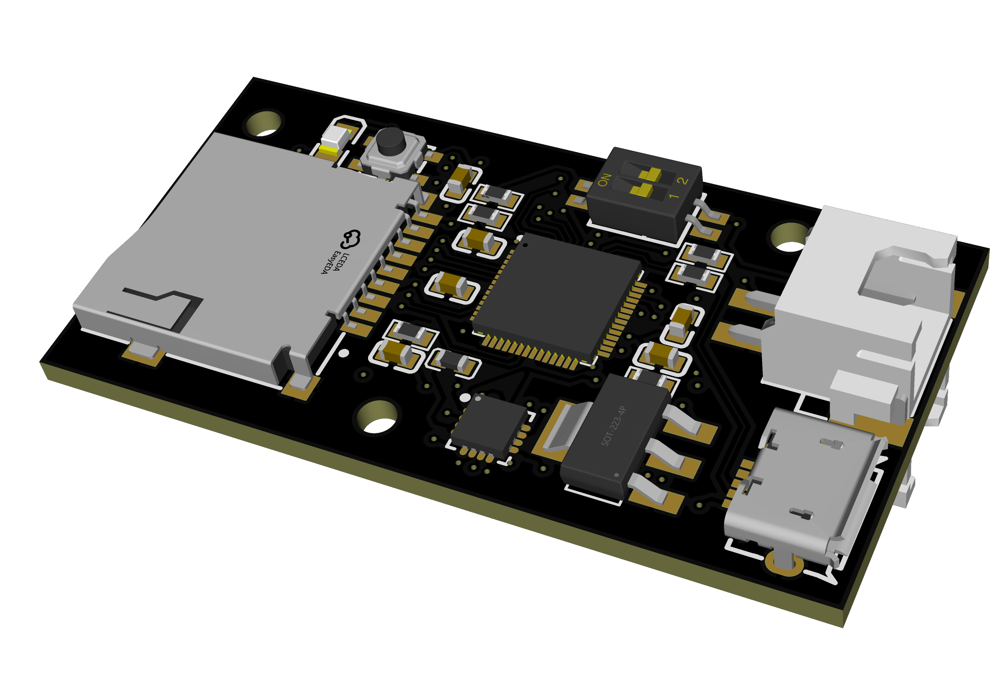

# AiforCNC — CNC-Vibration

2024年南台科大智慧製造中心 AI 應用於智慧製造 CNC 研究：透過三軸加速度計採集 CNC 加工時的振動訊號，依刀具磨耗程度標註，訓練邊緣端分類模型，即時判斷刀具磨耗狀態，用於 CNC 加工預測性維護。



## 專案架構

* **硬體端**：Raspberry Pi Pico（RP2040）+ 三軸加速度計 + SD卡模組
* **韌體端**：資料採集韌體，見 [`firmware/`](firmware)
* **軟體端**：資料分析與 AI 訓練，見 [`analysis/`](analysis)、[`model/`](model)

## 目錄結構

```
AiforCNC/
├── docs/               專案說明文件與圖片
│   ├── introduction.md      CNC加工介紹
│   ├── methodology.md       實驗方法
│   ├── firmware-notes.md    韌體說明
│   └── images/
├── firmware/            資料採集韌體（Arduino / RP2040）
│   ├── v1/                   第一版
│   └── v2/                   第二版
├── analysis/            資料讀取與視覺化腳本
├── model/               Edge Impulse 匯出之推論模型（C++ library）
│   └── CNC-Vibration_inferencing/
├── data/raw/            原始實驗數據（CSV）
│   ├── pilot_20241208/       前期小規模測試
│   ├── 20250403_original/    刀具磨耗實驗原始數據
│   └── 20250404_renamed/     整理檔名後之版本
├── LICENSE
└── README.md
```

## 模型

已於 Edge Impulse 平台（專案 CNC-Vibration）訓練分類模型並匯出，詳見 [`model/CNC-Vibration_inferencing`](model/CNC-Vibration_inferencing)。

## License

Apache License 2.0，詳見 [LICENSE](LICENSE)。
