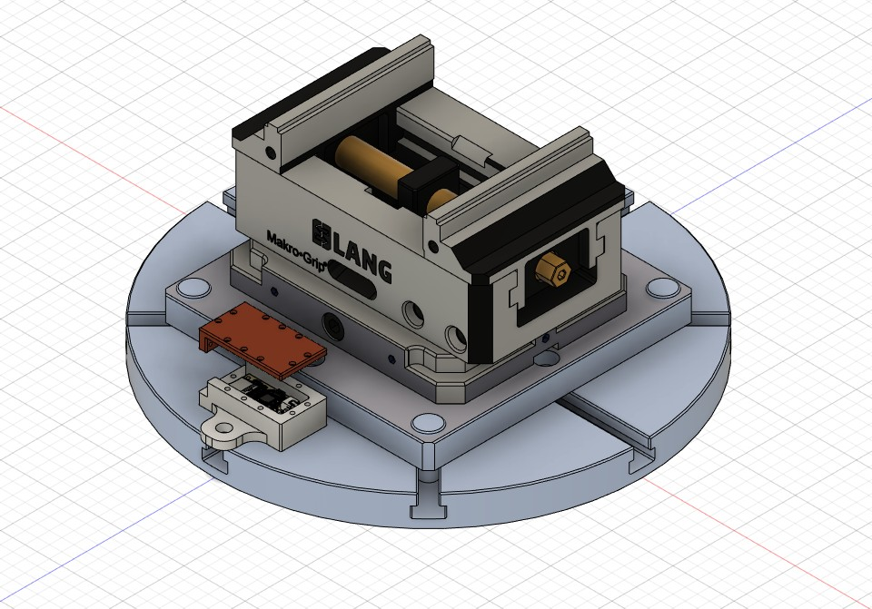
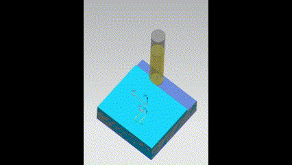

# 實驗方法
## 1.說明
我的的實驗是利用第一段程式的跟四種的刀具損耗程度來去檢測cnc在切削時產生的振動以及cnc的切削參數來去做紀錄他的振動數據在利用第三方的網站來去訓練ai訓練完後再載入第二段程式來去做檢測


## 2.工具準備
### 5軸工具機型號(Tongtai CT-350)
### 端銑刀與材料規格
|||
| :-----:| :----: |
| 刀刃直徑(mm) | 10 |
| 刀刃數 | 3 |
| 材料 | SC45 |
| 材料尺寸(mm) | 50*50 |

## 3.實驗條件
### 如何產生刀具磨耗
| 端銑刀磨耗 | 切消時間(min) |
| :-----:| :----: |
| 全新的 | 0 |
| 輕度損耗 | 30 |
| 中度損耗 | 60 |
| 重度損耗 | 180 |
### sensor擺放位子

### 切削圖檔[毛胚料圖檔.ipt](3D圖檔/毛胚料圖檔.ipt)
### 切削路徑


```
print()
```


## 4.切削實驗參數

|轉速(rpm)|3500|
| :-----| :----: |
| 進給速度(mm/sec) | 141 |
| 切削深度(mm) | 0.2 |


## 5.數據準備


## 6.用於AI訓練的數據格式