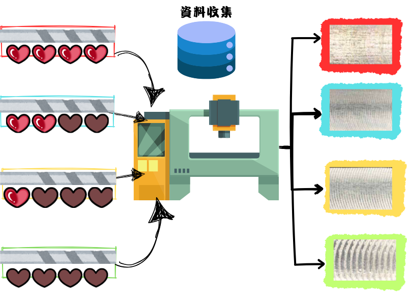

# 實驗方法
## 1.說明
我的的實驗是利用第一段程式的跟四種的刀具損耗程度來去檢測cnc在切削時產生的振動以及cnc的切削參數來去做紀錄他的振動數據在利用第三方的網站來去訓練ai訓練完後再載入第二段程式來去做檢測



## 2.工具準備
*
*
*
*

## 3.實驗條件

```
print()
```


## 4.切削實驗參數


## 5.數據準備


## 6.用於AI訓練的數據格式